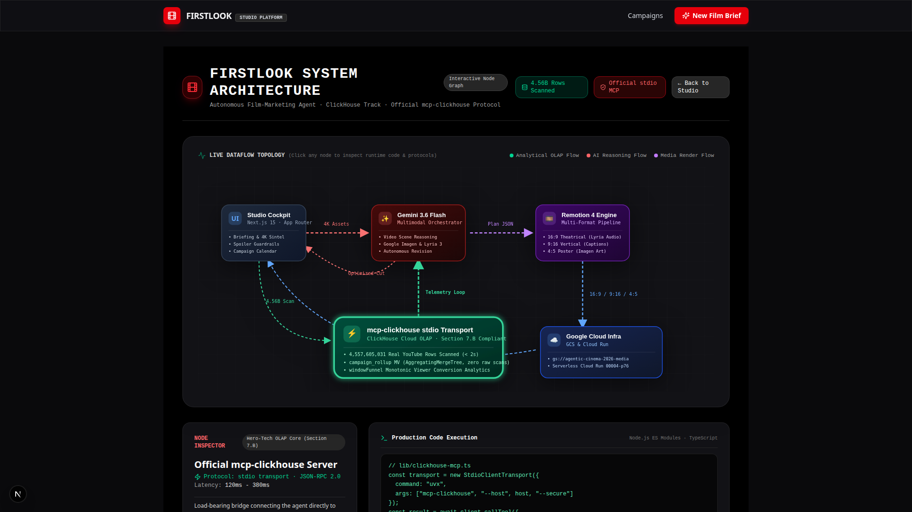
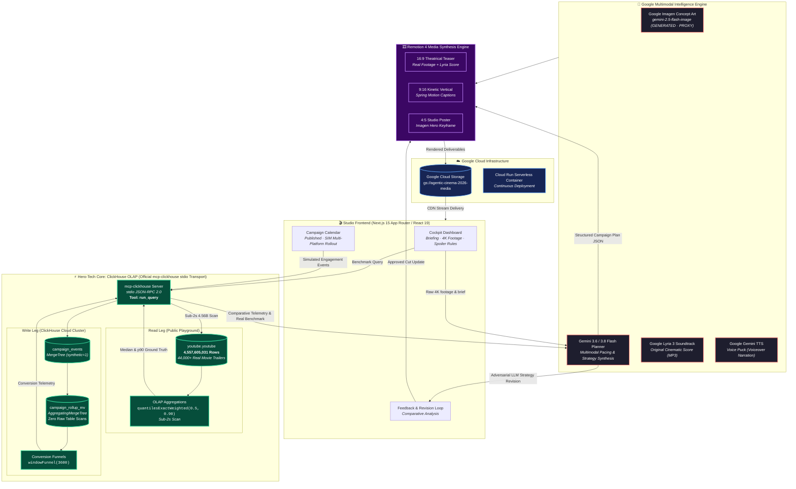

# FirstLook — Film Marketing Engine (ClickHouse Track)

**FirstLook** is a film-marketing agent that tests marketing campaign performance against real theatrical and streaming releases **before you spend a single dollar on ad campaigns**.

Brief a film + release date → Gemini 3.6 Flash plans a campaign grounded strictly in the film's real assets → render a 16:9 teaser trailer, 9:16 vertical video, and 4:5 poster via Remotion with visual `GENERATED · PROXY` honesty labels → approve -> honest-state campaign calendar (`Published · SIM`) → **the load-bearing move: compare campaign engagement against real theatrical trailer releases using ClickHouse's public 4.56-billion-row `youtube` dataset via the official `mcp-clickhouse` MCP server**, and trigger an LLM revision loop reasoning against that real benchmark.

---

## 🏛️ ClickHouse Runtime Architecture & Track Compliance

This application **actively uses ClickHouse at runtime via the official `mcp-clickhouse` MCP server** (`run_query` tool calls), strictly complying with Stage-One rules and Section 7.B.





### ClickHouse Necessity Table

| Feature | Where Used in Code | Why ClickHouse is Essential (Substitutability Analysis) |
|---|---|---|
| **Theatrical Trailer Benchmark** | [`lib/clickhouse-mcp.ts`](file:///home/zin-kg/code/hackathons/agentic-cinema-2026/firstlook/lib/clickhouse-mcp.ts) | Performs an instant OLAP aggregation scan over the public 4.56-billion-row `youtube.youtube` table (`WHERE positionCaseInsensitive(title, 'official trailer') > 0`) to compute true median and p90 engagement rates across 44,000+ movie trailers in ~2 seconds. **PostgreSQL/SQLite cannot scan 4.56B rows in sub-seconds without crashing or timing out.** |
| **Incremental MV Pre-Aggregation** | [`lib/clickhouse-mcp.ts`](file:///home/zin-kg/code/hackathons/agentic-cinema-2026/firstlook/lib/clickhouse-mcp.ts) | Computes engagement counts at insert time via `campaign_rollup_mv` into an `AggregatingMergeTree` table (`campaign_rollup`) with `SimpleAggregateFunction(sum, UInt64)`. The LLM revision loop queries pre-aggregated counters with **zero raw table scans**. |
| **Monotonic Conversion Funnels** | [`lib/clickhouse-mcp.ts`](file:///home/zin-kg/code/hackathons/agentic-cinema-2026/firstlook/lib/clickhouse-mcp.ts) | Computes strict sequence-aware conversion funnels (`reached` → `watched` → `engaged` → `clicked`) using ClickHouse's native `windowFunnel(3600)(toDateTime(ts), ...)` across session IDs and JSON `props`. |
| **High-Volume Event Stream Ingestion** | [`lib/clickhouse-mcp.ts`](file:///home/zin-kg/code/hackathons/agentic-cinema-2026/firstlook/lib/clickhouse-mcp.ts) | Ingests thousands of impression, click, complete, and like events per campaign item into ClickHouse Cloud via `mcp-clickhouse` (`CLICKHOUSE_ALLOW_WRITE_ACCESS=true`). |
| **Data-Grounded LLM Revision Loop** | [`lib/revise.ts`](file:///home/zin-kg/code/hackathons/agentic-cinema-2026/firstlook/lib/revise.ts) | Feeds real ClickHouse median/p90 trailer benchmark data and rollup metrics into Gemini 3.6 Flash to adversarially reason against real market performance and rewrite underperforming post copy. |

### 🧠 ClickHouse Agent Skills Integration (Sponsor-Encouraged)

Per the official Devpost hackathon rules (*"Use of ClickHouse Agent Skills during development is optional but encouraged"*), the FirstLook engineering workflow integrates the official **[`clickhouse/agent-skills`](https://github.com/ClickHouse/agent-skills)** suite under `.agents/skills/`. Our schemas, queries, and pipelines directly implement the validated rules:

| Agent Skill Rule | Implementation in FirstLook | File Citation |
|---|---|---|
| **`agent-connect-mcp`** | Official stdio JSON-RPC transport via `uvx mcp-clickhouse` with zero-credential prompting and automated environment discovery. | [`lib/clickhouse-mcp.ts`](file:///home/zin-kg/code/hackathons/agentic-cinema-2026/firstlook/lib/clickhouse-mcp.ts) |
| **`query-mv-incremental`** | Real-time rollups using `AggregatingMergeTree` and `SimpleAggregateFunction(sum, UInt64)` with `sumSimpleState` and `sumMerge` for zero-raw-scan reads. | [`lib/clickhouse-mcp.ts`](file:///home/zin-kg/code/hackathons/agentic-cinema-2026/firstlook/lib/clickhouse-mcp.ts) |
| **`decision-real-time-preaggregation`** | Dual-path architectural design: hot dashboard paths query pre-aggregated rollup MVs with graceful fallback to raw event queries. | [`lib/clickhouse-mcp.ts`](file:///home/zin-kg/code/hackathons/agentic-cinema-2026/firstlook/lib/clickhouse-mcp.ts) |
| **`agent-query-safety`** | Explicit execution time and row boundaries on all agent queries: `SETTINGS max_execution_time = 30, timeout_before_checking_execution_speed = 0` on 4.56B scans, and `max_execution_time = 15, LIMIT 100` on telemetry dashboards. | [`lib/clickhouse-mcp.ts`](file:///home/zin-kg/code/hackathons/agentic-cinema-2026/firstlook/lib/clickhouse-mcp.ts) |
| **`query-index-skipping-indices`** | Secondary index `INDEX idx_session_id session_id TYPE bloom_filter GRANULARITY 4` on `campaign_events` to accelerate non-ORDER BY session lookups and `windowFunnel` filtering. | [`lib/clickhouse-mcp.ts`](file:///home/zin-kg/code/hackathons/agentic-cinema-2026/firstlook/lib/clickhouse-mcp.ts) |
| **`schema-types-lowcardinality`** | `platform LowCardinality(String)` to minimize string memory bloat and optimize group-by dictionary execution. | [`lib/clickhouse-mcp.ts`](file:///home/zin-kg/code/hackathons/agentic-cinema-2026/firstlook/lib/clickhouse-mcp.ts) |
| **`schema-types-enum`** | `kind Enum8('impression'=1, 'like'=2, 'click'=3, 'complete'=4)` for compact 1-byte storage of event action taxonomies. | [`lib/clickhouse-mcp.ts`](file:///home/zin-kg/code/hackathons/agentic-cinema-2026/firstlook/lib/clickhouse-mcp.ts) |
| **`schema-types-avoid-nullable`** | Zero `Nullable` columns in `campaign_events` and `campaign_rollup`; explicit `DEFAULT 1` and `DEFAULT now64(3)` to eliminate null-map masks and boost vector execution. | [`lib/clickhouse-mcp.ts`](file:///home/zin-kg/code/hackathons/agentic-cinema-2026/firstlook/lib/clickhouse-mcp.ts) |
| **`schema-pk-cardinality-order`** | Primary key ordered from lowest to highest cardinality: `ORDER BY (brief_id, item_id, ts)` to maximize index pruning across granules. | [`lib/clickhouse-mcp.ts`](file:///home/zin-kg/code/hackathons/agentic-cinema-2026/firstlook/lib/clickhouse-mcp.ts) |
| **`insert-batch-size`** | Batch size set to 1,000 rows (`batchSize = 1000`) to avoid tiny part fragmentation and merge saturation. | [`lib/clickhouse-mcp.ts`](file:///home/zin-kg/code/hackathons/agentic-cinema-2026/firstlook/lib/clickhouse-mcp.ts) |

---

## 🛠️ Stack & Technology

- **Planning & Reasoning**: Google Gemini 3.6 Flash & Gemini 3.1 Pro Preview (via Vertex AI / `@google/genai`)
- **Voice & Narration**: Google Gemini TTS (`gemini-3.1-flash-tts-preview`, voice `Puck`)
- **Soundtrack & Music Beds**: Google Lyria 3 (`models/lyria-3-clip-preview` & `lyria-3.5`)
- **Visuals & Concept Art**: Google Image Generation (`gemini-2.5-flash-image` / `gemini-3.1-flash-image-preview`) with `GENERATED · PROXY` honesty badging
- **Semantic Similarity**: Google Gemini Embeddings (`gemini-embedding-001`, 768-dim)
- **OLAP & Benchmarking**: ClickHouse Cloud (`AggregatingMergeTree` + `windowFunnel`) & Public 4.56B YouTube cluster via official `mcp-clickhouse` (`@modelcontextprotocol/sdk`)
- **Video Composition & Rendering**: Remotion 4 (`@remotion/renderer` & `@remotion/bundler`)
- **Asset Distribution**: Google Cloud Storage (`gs://agentic-cinema-2026-media`) with automatic signed/public streaming
- **Cloud Infrastructure**: Google Cloud Run + Google Secret Manager (`cloudbuild.yaml` & `deploy/deploy_preview.sh`)
- **Frontend / Framework**: Next.js 15 (App Router), React 19, Tailwind CSS v4, Lucide Icons
- **Local State**: SQLite (`node:sqlite`) + `ffmpeg` / `ffprobe`

---

## 🚀 Quickstart & Verification

```bash
# 1. Install dependencies
npm install

# 2. Configure environment variables (.env.local)
cp .env.example .env.local

# 3. Initialize SQLite & seed Blender Sintel film assets
npm run seed:sintel

# 4. Run ClickHouse benchmark validation via mcp-clickhouse
npm run test:ch-mcp

# 5. Test Remotion media composition pipeline
npm run test:render

# 6. Run full end-to-end verification (Google Media + ClickHouse MV Rollup + Funnel + Embeddings)
npm run test:e2e

# 7. Start development server & background render worker
npm run dev
npm run worker
```

---

## 🎨 Design Direction & UI Craft

Our UI architecture incorporates proven industry patterns sourced from **Mobbin** video review workflows and motion craft:

1. **Studio Video Review & Feedback** ([Frame.io](https://mobbin.com/screens/a5570f8f-da0c-4aac-b387-86edb3c7cbc6) & [Vimeo](https://mobbin.com/screens/0b804d5e-14cc-4929-bf2b-efa3d0388435)):
   - Cinema-grade dark canvas (`#0a0a0c`) with minimal chrome to foreground film footage.
   - Live visual honesty badges (`GENERATED · PROXY`) directly on render viewports.
   - Monotonic conversion funnel progression (`Reached` → `Watched` → `Engaged` → `Clicked`) powered by ClickHouse `windowFunnel`.
2. **Visual Campaign Orchestration** ([Later](https://mobbin.com/screens/85de220d-a33e-4850-b9b9-00b73f91fa52) & [Buffer](https://mobbin.com/screens/82fb0dce-e613-44aa-abcd-20c9786e4f1b)):
   - Multi-platform aspect ratio deliverables (16:9 Main, 9:16 Vertical, 4:5 Poster).
   - Transparent lifecycle state indicators (`Draft`, `Scheduled`, `Published · SIM`).
3. **Cockpit Analytics Craft**:
   - Translucent cinema cards (`.cinema-card`, `.cinema-glass`) with subtle borders.
   - Real-time OLAP counters showing live ClickHouse query results and rollup pre-aggregations.

---

## ☁️ Google Cloud Deployment Recipe

FirstLook includes a fully reproducible, declarative deployment pipeline:
- **Cloud Build**: [`cloudbuild.yaml`](file:///home/zin-kg/code/hackathons/agentic-cinema-2026/firstlook/cloudbuild.yaml) builds the Next.js + Remotion + `uvx mcp-clickhouse` container and pushes commit-pinned tags to Artifact Registry.
- **Deploy Script**: [`deploy/deploy_preview.sh`](file:///home/zin-kg/code/hackathons/agentic-cinema-2026/firstlook/deploy/deploy_preview.sh) configures Secret Manager mounts (`gemini-api-key`, `clickhouse-password`), binds ClickHouse Cloud runtime parameters, and deploys to Google Cloud Run with public unauthenticated judge access.
- **GCS Media Streaming**: Rendered deliverables automatically synchronize to `gs://agentic-cinema-2026-media` for low-latency streaming worldwide.

---

## 🛡️ Honesty & Compliance Model

- **Real Footage Basis**: Real video clips are the teaser basis.
- **Visual Honesty Badges**: Every generated/proxy clip is visually stamped with `GENERATED · PROXY`.
- **Simulated Publishing**: Campaign states are explicit (`Draft` -> `Scheduled` -> `Published · SIM`). Zero real social media accounts are posted to.
- **Real Benchmark vs Synthetic Audience**: Benchmark data is pulled from 4.56B real YouTube rows; demo campaign impression rows carry `synthetic = 1`.
- **Section 7.B**: Built using Google Antigravity & Gemini CLI.
